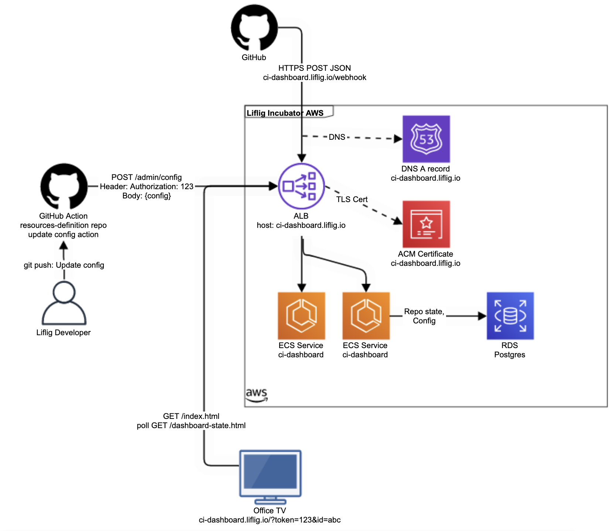

# Liflig REST baseline

Replace any sample values inside `< >` in these files:

- README.md
- [.github/workflows/ci.yaml.template](.github/workflows/ci.yaml.template), and rename to `ci.yaml`
- [.ldp.json](.ldp.json)

You might have success with this script: https://gist.github.com/stekern/23e4804c0801520b50c0c3e5b3822138
to replace placeholders.

Refactor the package name to suit your needs.
Then update the [pom.xml](pom.xml)'s package for `MainKt` (`maven-shade-plugin`)

---

# GitHub Actions CI-Dashboard


[](https://github.com/capralifecycle/github-actions-ci-dashboard/actions/workflows/ci.yaml)
[](https://sonarcloud.io/summary/new_code?id=capralifecycle_github-actions-ci-dashboard)
[](https://sonarcloud.io/summary/new_code?id=capralifecycle_github-actions-ci-dashboard)

Responsible for collecting GitHub Actions `workflow_run` webhook data and providing a web dashboard with recent CI build status.

## Documentation

More information is found here:

- [Solution specification/architecture (Confluence)](https://liflig.atlassian.net/l/cp/Qc1oFmJF)
- [Overview of the design process (Confluence)](https://liflig.atlassian.net/wiki/x/PgBSDg)

### Architecture



## Contributing

### Getting started

#### Tool dependencies

You need to install:

- Docker
- Maven (or run maven through IntelliJ)
- JDK 17
    - `brew tap homebrew/cask-versions` and then`brew install --cask temurin17`

#### Developer machine setup

0. [Authenticate to Github Packages](https://docs.github.com/en/packages/working-with-a-github-packages-registry/working-with-the-apache-maven-registry) for internal maven
   repos.
1. Create an `overrides.properties` by running
    ```shell
    ./init-local-env.sh
    ```
3. Install ktfmt plugin to IntelliJ

### Running the application

1. Build the jar: `mvn package`
2. Build and run the docker image with `./test-docker.sh`.

You can test the API with [src/test/http/health.http](src/test/http/health.http)

### Running tests

```shell
mvn verify
```

Add `-DskipTests` to `mvn` to disable all tests.
Add `-DskipITs` to only disable integration tests.

### Linting

Only check lint: `mvn spotless:check`

Fix: `mvn spotless:apply`

### Deploying

Push the master branch.
You can track the progress in [GitHub Actions](https://github.com/capralifecycle/github-actions-ci-dashboard/actions/workflows/ci.yaml)
and in
the [AWS CodePipeline](https://eu-west-1.console.aws.amazon.com/codesuite/codepipeline/pipelines/experiments-apps/view?region=eu-west-1) (`liflig-experiments`).

## Open Telemetry

You can disable the java agent in ECS by setting the environment parameter `OTEL_JAVAAGENT_ENABLED` to `false`.

You can collect data by attaching a sidecar in ECS with the AWS Distro of Otel Collector: https://aws-otel.github.io/docs/setup/ecs.

## License

```text
Copyright 2024 Liflig By Capra AS

Licensed under the Apache License, Version 2.0 (the "License");
you may not use this file except in compliance with the License.
You may obtain a copy of the License at

   http://www.apache.org/licenses/LICENSE-2.0

Unless required by applicable law or agreed to in writing, software
distributed under the License is distributed on an "AS IS" BASIS,
WITHOUT WARRANTIES OR CONDITIONS OF ANY KIND, either express or implied.
See the License for the specific language governing permissions and
limitations under the License.
```
